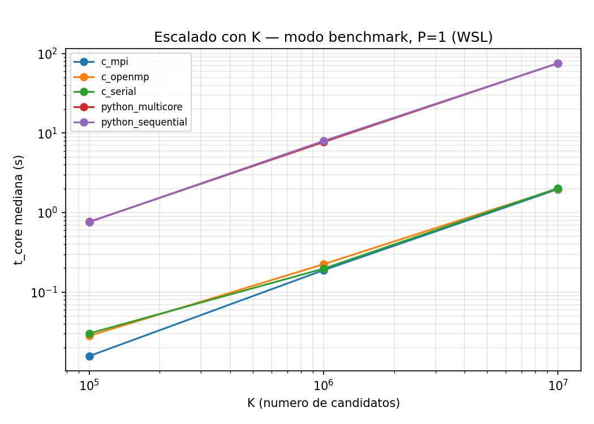
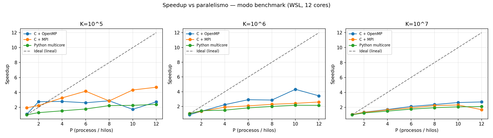
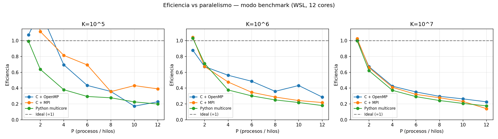
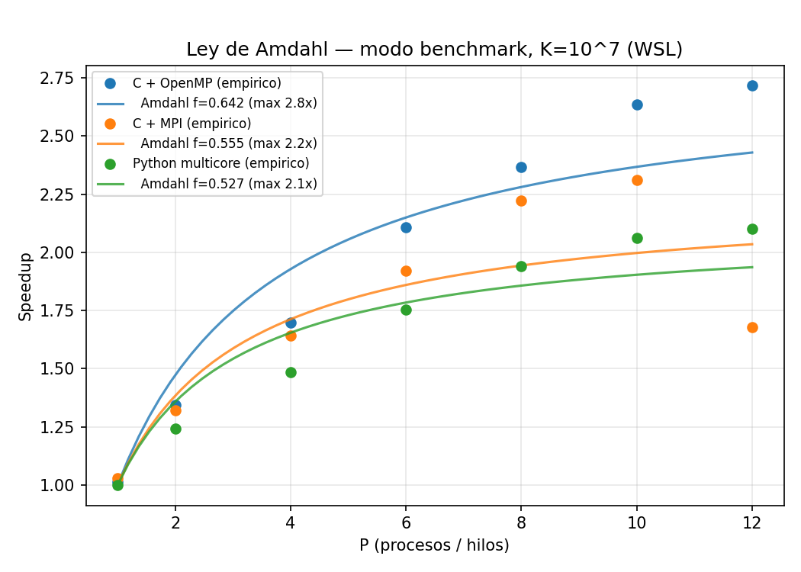
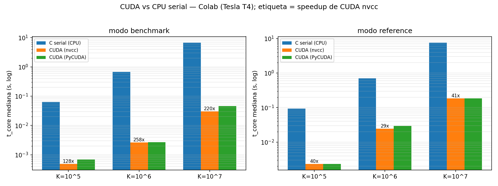

# 1. Resumen y objetivo

El proyecto resuelve un problema de **clasificación binaria metagenómica**: dadas 10 muestras
(5 sanas, `y=0`; 5 enfermas, `y=1`) y tres perfiles por ítem (taxonómico `T`, ecológico `S`,
funcional `F`), se busca el vector de pesos **W = (W₁, W₂, W₃)** sobre el simplex
(`W₁+W₂+W₃ = 1`, `Wᵢ ≥ 0`) que **maximiza el AUC** de la clasificación.

El algoritmo de búsqueda es un **Random Search** sobre **K candidatos** de W generados uniformemente
en el simplex. Por cada candidato se calcula el score de las 10 muestras
(`Pᵢ = W₁·Tᵢ + W₂·Sᵢ + W₃·Fᵢ`, `Score = A·P`) y su **AUC entero** (`auc_units = 2·wins + ties`,
denominador 50). Gana el candidato de mayor `auc_units`; ante empate, el de **menor índice global k**
(desempate determinista codificado en una clave int64).

El objetivo HPC es implementar **el mismo algoritmo** en **cinco variantes** y comparar su
rendimiento (tiempo, speedup, eficiencia y Ley de Amdahl):

1. **Python secuencial** (NumPy, BLAS monohilo) — línea base de la familia Python.
2. **Python multicore** (`multiprocessing`, `spawn`, reparto del rango de candidatos).
3. **C + OpenMP** (kernel *fused*, reducción por clave int64) — línea base de la familia C es `c_serial`.
4. **C + MPI** (partición contigua de `[0,K)`, `MPI_Allreduce(MAX)`).
5. **CUDA** (kernel *fused* en GPU, `atomicMax` de la clave; variantes nvcc y PyCUDA).

# 2. Metodología

## 2.1 Plataformas de medición

| Plataforma | Hardware | Implementaciones medidas |
|---|---|---|
| `wsl` | WSL Ubuntu, **12 cores** (CPU) | `python_sequential`, `python_multicore`, `c_serial`, `c_openmp`, `c_mpi` |
| `colab` | Google Colab, GPU **Tesla T4** (~2 vCPUs) | `c_serial` (referencia CPU), `cuda` (nvcc), `cuda_pycuda` |

El **speedup nunca mezcla plataformas** (hardware distinto): cada familia se compara contra su
línea base serial **del mismo host, modo y K**.

## 2.2 Diseño experimental

- **Modos de precisión**: `reference` (float64, oráculo de corrección) y `benchmark` (float32,
  rendimiento). No se mezclan tiempos entre modos.
- **Rejilla**: N = 50 (fijo); **K ∈ {10⁵, 10⁶, 10⁷}**; **P ∈ {1, 2, 4, 6, 8, 10, 12}**
  (grado de paralelismo: `n_workers`/`n_threads`/`n_procs`).
- **Repeticiones**: 3 por punto; se reporta la **mediana** de `t_core`.
- **Métricas de tiempo**: `t_core` = tiempo del núcleo de cómputo (para Amdahl); `t_search` = tiempo
  total de la búsqueda incluyendo dispatch/IPC/reducción. En las seriales `t_core == t_search`.
- **Baselines del speedup**: familia Python → `python_sequential` (P=1); familia C
  (`c_serial`/`c_openmp`/`c_mpi`) → `c_serial` (P=1); CUDA → `c_serial` del mismo host.
  `efficiency = speedup / P` (solo para multicore/OpenMP/MPI).

Los datos crudos y agregados están en `results/benchmark.csv` (resumen versionado, 156 filas).

# 3. Corrección

Todas las implementaciones, en ambos modos y para todos los K, encuentran el **mismo ganador**:

| Campo | Valor |
|---|---|
| `best_k` | 0 |
| `auc_units` | 50 / 50 |
| `auc` | 1.000 |
| `consistency` (balanced accuracy) | 1.000 (≥ 0.8 ✓) |

La equivalencia se validó **exacta** contra el oráculo Python (`C_OpenMP_MPI/validate.sh` y
`CUDA/colab_validate.sh`): `best_k`, `auc_units`, `auc`, `best_w`, `scores`, `theta` y `consistency`
coinciden en `reference`. En `benchmark` (f32), los campos de decisión coinciden exacto; `scores`/`theta`
del kernel nvcc difieren por ULPs de float32 (FMA distinto al de NumPy), por lo que el comparador es
**f32-aware** (tolerancia 1e-5 solo en esos campos auxiliares). La invariancia de MPI al número de
procesos también se verificó (1/2/4/8/12 ranks → mismo resultado).

> El AUC perfecto se discute en la §7: es consecuencia de la señal inyectada en el dataset sintético,
> no una afirmación de generalización.

# 4. Speedup y eficiencia (escalado CPU, WSL)

## 4.1 Tiempos absolutos

A K = 10⁷ (modo `benchmark`), el salto **Python → C** domina cualquier ganancia por paralelismo:

| Implementación | P | `t_core` mediana (s) | Comentario |
|---|---:|---:|---|
| `python_sequential` | 1 | 75.33 | base Python |
| `python_multicore` | 12 | 35.86 | 2.10× sobre Python serial |
| `c_serial` | 1 | 2.025 | **~37× más rápido que Python serial** |
| `c_openmp` | 12 | 0.745 | 2.72× sobre C serial |
| `c_mpi` | 10 | 0.876 | 2.31× sobre C serial |

El cambio de lenguaje (NumPy → C *fused*) aporta ~37×, mucho más que el ~2–3× del paralelismo de
memoria compartida en este problema. El escalado lineal del kernel con K (O(K)) se aprecia en la
figura de escalado:

## 4.2 Speedup vs paralelismo

Observaciones:

- **A K pequeño (10⁵)** el speedup es pobre y ruidoso: el trabajo por candidato es minúsculo y domina
  el **overhead** (creación de hilos en OpenMP, IPC y serialización en MPI/multicore). OpenMP incluso
  retrocede en algún P por contención y *scheduling*.
- **A K grande (10⁷)** las curvas se estabilizan pero **saturan pronto** (~2.5–2.7×) lejos del ideal
  lineal: el kernel es **memory-bound** (recorre A, T, S, F por candidato con poca reutilización) y el
  problema es de grano fino, por lo que el ancho de banda y la fracción serial limitan el escalado.
- **OpenMP > MPI > multicore** en eficiencia: los hilos comparten memoria sin copias; MPI replica la
  carga por rank y paga la reducción; `python_multicore` arrastra además el costo de `spawn` y la
  serialización de resultados. La eficiencia cae de forma monótona con P (~1.0 en P=1 a ~0.18–0.23 en
  P=12), típico de un problema con techo de Amdahl bajo.
- El modo `reference` (f64) muestra el mismo patrón con tiempos algo mayores (ver figuras
  `*_reference.png` y los anexos).

# 5. Ley de Amdahl

Ajustando el modelo `S(P) = 1 / ((1−f) + f/P)` (un parámetro, forzando `S(1)=1`) sobre el speedup
empírico a K = 10⁷ se obtiene la **fracción paralela f** y el speedup asintótico `1/(1−f)`:

| Familia | f (benchmark) | Speedup máx. teórico |
|---|---:|---:|
| C + OpenMP | 0.642 | 2.8× |
| C + MPI | 0.555 | 2.2× |
| Python multicore | 0.527 | 2.1× |

La fracción paralela efectiva es **moderada (~0.53–0.64)**, no porque el algoritmo sea intrínsecamente
serial (el bucle sobre K es *embarrassingly parallel*), sino porque el **grano es fino** y los costos
fijos (carga replicada, reducción, dispatch, ancho de banda compartido) pesan frente al cómputo útil.
Esto explica por qué ninguna variante CPU supera ~2.8× en 12 cores: el techo de Amdahl, no el número
de núcleos, es el factor limitante. OpenMP exhibe la mayor `f` (menor overhead relativo), coherente
con su mejor eficiencia observada.

# 6. CUDA (Tesla T4)

La GPU ataca el paralelismo de grano fino sobre K de forma natural (un hilo por candidato, reducción
del argmax por `atomicMax` de la clave int64). Frente a `c_serial` del **mismo host** (Colab):

| Modo | K | `cuda` (nvcc) | speedup vs C serial |
|---|---:|---:|---:|
| benchmark | 10⁵ | 0.49 ms | 128× |
| benchmark | 10⁶ | 2.63 ms | 258× |
| benchmark | 10⁷ | 30.6 ms | 220× |
| reference | 10⁷ | 184 ms | 41× |

- En `benchmark` (f32) la T4 rinde **~130–260×** sobre la CPU serial; el pico relativo está en K=10⁶
  (suficiente trabajo para amortizar el lanzamiento del kernel sin saturar memoria).
- En `reference` (f64) la ventaja baja a **~30–41×**: la T4 tiene throughput f64 muy reducido frente
  a f32, como es esperable en GPUs de consumo.
- `cuda` (nvcc) y `cuda_pycuda` comparten **el mismo kernel** (`scoring_device.cuh`), por lo que su
  rendimiento es casi idéntico; las pequeñas diferencias son del *driver*/host (H2D/D2H y recompute).
- `t_core` mide solo el kernel (cudaEvent); `t_search` añade la transferencia de candidatos H2D y el
  resultado D2H. Para K grande el kernel domina; para K pequeño la transferencia es comparable.

# 7. Separabilidad y AUC

El dataset principal alcanza **AUC = 1.0** y **consistency = 1.0** porque fue generado **con señal**
(`signal_strength = 1.0`): existe un W que separa perfectamente las clases. Con solo **10 muestras**
el AUC es una métrica **gruesa** (denominador 50, granularidad 1/50), de modo que la separación
perfecta es alcanzable y estable, pero **no implica generalización**: hay riesgo de sobreajuste a las
10 muestras fijas. La "verdad oculta" del generador (`W_true`, riesgo latente `r`, medias por clase)
**nunca** es leída por el scoring, así que el AUC=1.0 refleja la capacidad de la búsqueda de hallar un
W separador, no fuga de información. Para un escenario más realista podría reducirse `signal_strength`
(decisión de producto pendiente).

# 8. Conclusiones

1. **El lenguaje importa más que el paralelismo CPU aquí**: pasar de NumPy a C *fused* da ~37×, frente
   al ~2–3× del paralelismo de 12 cores. El cuello de botella es de grano fino y memory-bound.
2. **El paralelismo CPU satura por Amdahl** (`f ≈ 0.53–0.64`), no por falta de núcleos: techo teórico
   ~2–2.8×. OpenMP es el más eficiente (memoria compartida sin copias), seguido de MPI y multicore.
3. **La GPU es la ganadora absoluta** para este Random Search: **~130–260×** en f32 sobre la CPU serial,
   gracias al paralelismo masivo sobre K. La penalización f64 (~30–41×) es la esperada en una T4.
4. **Corrección garantizada**: las 5 variantes coinciden en el ganador y métricas, validadas contra el
   oráculo Python en ambos modos; MPI es invariante al número de procesos.

# Anexos — tablas completas

Las medianas por `platform/implementation/mode/K/P`, con speedup y eficiencia, están en
`results/benchmark.csv` (columnas: `platform, implementation, mode, N, K, P, reps, t_core_median_s,
t_search_median_s, speedup, efficiency, best_k, auc_units, auc, consistency, consistency_pass, device`).
Las corridas crudas (3 reps/punto) están en `results/benchmark_runs.csv`.

Figuras (en `results/plots/`):

- `speedup_{benchmark,reference}.png`, `efficiency_{benchmark,reference}.png`
- `amdahl_{benchmark,reference}.png`, `scaling_K_{benchmark,reference}.png`
- `cuda_comparison.png`

Reproducción: `python scripts/plot.py --csv results/benchmark.csv --out results/plots`.
